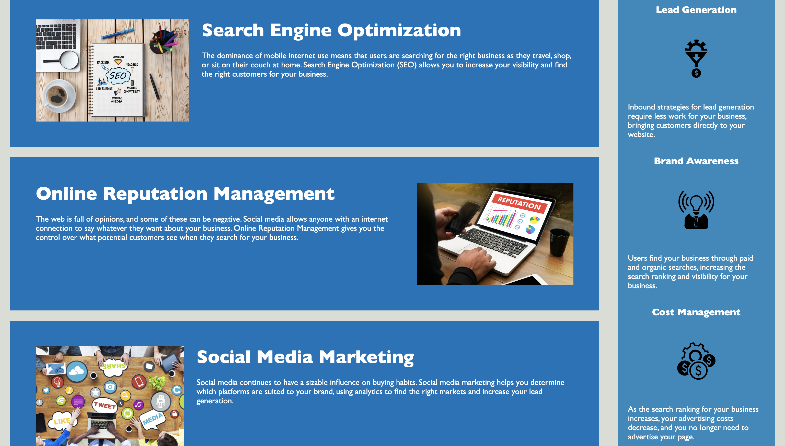

# <Challenge-01>

## Description
This site was created and to inform users on how to create sites relevant to search engines and increase reputation. I took part in optimizing this site to be more ADA compliant as well as be relevant to searches. I learned many semantics that are helpful in ADA compliance and is the modern language of CSS and HTML. This work was completed uitilizing CSS, HTML, Git, and some web research. 

## Installation
N/A

## Usage
To use this site, a user can use the navigation bar along the top of the page and click on the tabs created that will bring you to the specified information. The nav bar along the top looks like this:
```md

```

Clicking on any nav. bar links will bring the user to the content provided. Another way a user can reach the content is by scrolling down. Below is the specified content the user is able to find:
```md

```
Added information and facts are located to the right of the main content as seen in the above photo.

## Credits
While optimizing, I used a few web resources linked below:
- Using the `<figure>` element: https://www.codecademy.com/resources/docs/html/semantic-html/figure
- Adding a title to an image only in CSS: https://stackoverflow.com/questions/4216035/css-background-image-alt-attribute
- Optimizing syntax with semantics: https://coding-boot-camp.github.io/full-stack/html/html-cheatsheet


## License
N/A

## Features
Working features in this site include: 
- Working links
- Image title and alt. text

## Tests
Clicked all tabs on nav bar and confirmed all are working.
Click on "Search Engine Optimization", and it will route user to Search Engine Optimization content.
Click on "Online Reputation Management", and it will route user to Online Reputation Management.
Click on "Social Media Marketing", and it will route user to Social Media Marketing.